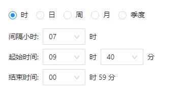
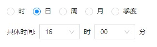
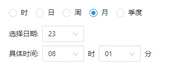
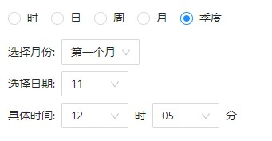

# 🌟 dy-cron-js


React Cron 组件，根据周期（时、日、周、月、季度）选择生成 Cron 表达式，和从 Cron 表达式反解析到界面

## 使用方法

1. 安装

```bash
$ yarn add dy-cron-js
```

2. 使用

```jsx
import React, { useState } from 'react';
import { Cron } from 'dy-cron-js';

export default () => {
  const [cron, setCron] = useState('00 12 11-23/01 * * ?');
  return (
    <Cron
      value={cron}
      onChange={value => {
        console.log(value);
        setCron(value.cron);
      }}
    />
  );
};
```

## 组件样式

- 时
  
- 日
  
- 周
  
- 月
  
- 季度
  
